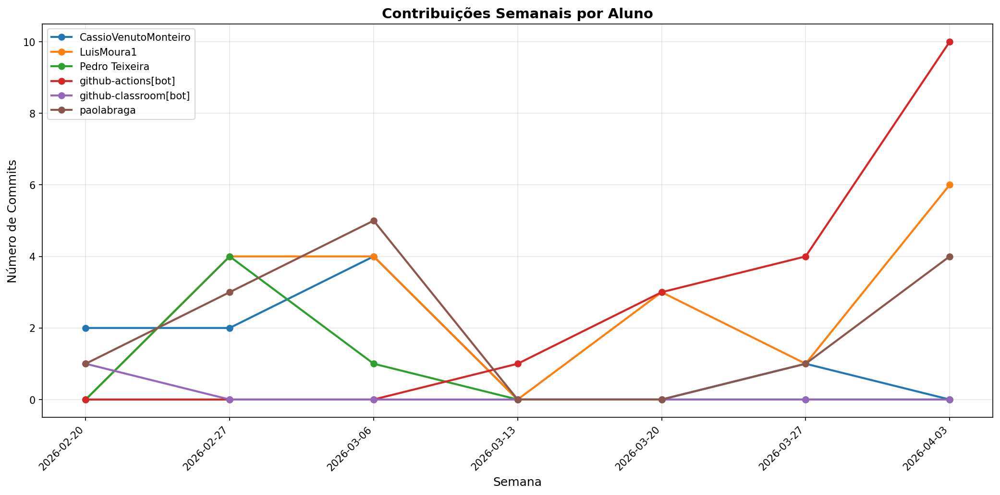

# 📊 Relatório de Contribuições do Projeto

**Última atualização:** 10/04/2026 20:19

---

## 📈 Resumo Geral de Contribuições

| Aluno                 |   Commits |   Linhas+ |   Linhas- |   Arquivos |   Docs Commits |   Docs Arquivos |
|-----------------------|-----------|-----------|-----------|------------|----------------|-----------------|
| CassioVenutoMonteiro  |         9 |        64 |        44 |          3 |              9 |               3 |
| LuisMoura1            |        18 |       132 |        78 |          4 |             18 |               4 |
| Pedro Teixeira        |         5 |        97 |        26 |          3 |              5 |               3 |
| github-actions[bot]   |        18 |       142 |       140 |          3 |             18 |               1 |
| github-classroom[bot] |         1 |      2152 |         0 |         45 |              1 |              13 |
| paolabraga            |        14 |       220 |        56 |          4 |             14 |               4 |

## 📅 Contribuições Semanais (Todo o Semestre)

**2026-04-03**: LuisMoura1: 6, github-actions[bot]: 10, paolabraga: 4

**2026-03-27**: CassioVenutoMonteiro: 1, LuisMoura1: 1, github-actions[bot]: 4, paolabraga: 1

**2026-03-20**: LuisMoura1: 3, github-actions[bot]: 3

**2026-03-13**: github-actions[bot]: 1

**2026-03-06**: CassioVenutoMonteiro: 4, LuisMoura1: 4, Pedro Teixeira: 1, paolabraga: 5

**2026-02-27**: CassioVenutoMonteiro: 2, LuisMoura1: 4, Pedro Teixeira: 4, paolabraga: 3

**2026-02-20**: CassioVenutoMonteiro: 2, github-classroom[bot]: 1, paolabraga: 1

## 📊 Visualização Gráfica

## ℹ️ Observações

- **Commits**: Número total de commits realizados

- **Linhas+**: Linhas de código adicionadas

- **Linhas-**: Linhas de código removidas

- **Arquivos**: Número de arquivos únicos modificados

- **Docs Commits**: Commits em arquivos de documentação

- **Docs Arquivos**: Arquivos de documentação modificados

---

*Relatório gerado automaticamente via GitHub Actions*
