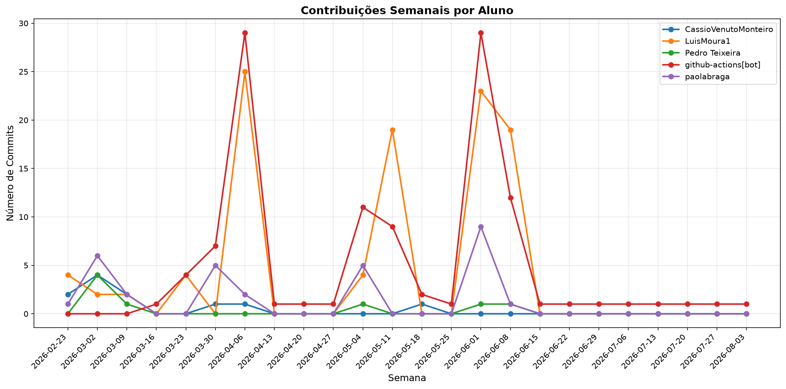

# 📊 Relatório de Contribuições do Projeto

**Última atualização:** 21/09/2026 00:06

---

## 📈 Resumo Geral de Contribuições

| Aluno                 |   Commits |   Linhas+ |   Linhas- |   Arquivos |   Docs Commits |   Docs Arquivos |
|-----------------------|-----------|-----------|-----------|------------|----------------|-----------------|
| CassioVenutoMonteiro  |        11 |        73 |        53 |          3 |             11 |               3 |
| LuisMoura1            |       102 |     28854 |     11184 |        109 |             46 |               7 |
| Pedro Teixeira        |         8 |       590 |        62 |          5 |              8 |               5 |
| github-actions[bot]   |       122 |       765 |       731 |          3 |            122 |               1 |
| github-classroom[bot] |         1 |      2152 |         0 |         45 |              1 |              13 |
| paolabraga            |        31 |       419 |       101 |          6 |             31 |               6 |

## 📅 Contribuições Semanais (Todo o Semestre)

**2026-09-14**: github-actions[bot]: 1

**2026-09-07**: github-actions[bot]: 1

**2026-08-31**: github-actions[bot]: 1

**2026-08-17**: github-actions[bot]: 1

**2026-08-10**: github-actions[bot]: 2

**2026-08-03**: github-actions[bot]: 1

**2026-07-27**: github-actions[bot]: 1

**2026-07-20**: github-actions[bot]: 1

**2026-07-13**: github-actions[bot]: 1

**2026-07-06**: github-actions[bot]: 1

**2026-06-29**: github-actions[bot]: 1

**2026-06-22**: github-actions[bot]: 1

**2026-06-15**: github-actions[bot]: 1

**2026-06-08**: LuisMoura1: 21, Pedro Teixeira: 1, github-actions[bot]: 13, paolabraga: 1

**2026-06-01**: LuisMoura1: 21, Pedro Teixeira: 1, github-actions[bot]: 28, paolabraga: 9

**2026-05-25**: github-actions[bot]: 1

**2026-05-18**: CassioVenutoMonteiro: 1, github-actions[bot]: 2

**2026-05-11**: LuisMoura1: 19, github-actions[bot]: 9

**2026-05-04**: LuisMoura1: 4, Pedro Teixeira: 1, github-actions[bot]: 11, paolabraga: 5

**2026-04-27**: github-actions[bot]: 1

**2026-04-20**: github-actions[bot]: 1

**2026-04-13**: github-actions[bot]: 1

**2026-04-06**: CassioVenutoMonteiro: 1, LuisMoura1: 25, github-actions[bot]: 29, paolabraga: 2

## 📊 Visualização Gráfica

## ℹ️ Observações

- **Commits**: Número total de commits realizados

- **Linhas+**: Linhas de código adicionadas

- **Linhas-**: Linhas de código removidas

- **Arquivos**: Número de arquivos únicos modificados

- **Docs Commits**: Commits em arquivos de documentação

- **Docs Arquivos**: Arquivos de documentação modificados

---

*Relatório gerado automaticamente via GitHub Actions*
